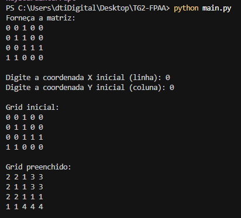

#  Algoritmo Flood Fill para Mapeamento de Terrenos

## 📋 Contribuidores

- [David Ho](https://github.com/Davidlh80)
- [Larissa Pedrosa](https://github.com/larisilvapedrosa)
- [Paula de Freitas](https://github.com/pauladefreitas)

## 📝 Descrição do Projeto
Este projeto implementa um sistema de mapeamento inteligente para robôs autônomos, utilizando o algoritmo Flood Fill para identificar e classificar regiões de um terreno previamente desconhecido. O sistema é capaz de identificar áreas livres conectadas e preenchê-las com cores distintas, facilitando a visualização e o planejamento de operações para robôs autônomos.

## 🎯 Contexto
- O terreno é representado como um grid bidimensional
- Cada célula pode ser um espaço livre (0) ou um obstáculo (1)
- Diferentes áreas do terreno podem ser separadas por barreiras
- O sistema identifica e "colore" automaticamente todas as áreas livres conectadas

- Visualização do grid antes e depois do preenchimento

## 🚀 Como Executar o Projeto

### Pré-requisitos
- Python 3.x instalado

### Passos para Execução

1. Clone o repositório:
```bash
   git clone https://github.com/Davidlh80/TG2-FPAA.git
   ```

2. Acesse a pasta do projeto:
```bash
   cd TG2-FPAA
   ```

3. Execute o programa:
```bash
python main.py
```

3. Siga as instruções no terminal:
   - Forneça a matriz do grid (digite uma linha vazia para finalizar)
   - Digite as coordenadas iniciais (x, y)

## Exemplos de Uso

### Exemplo 1
**Entrada:**
```
Grid inicial:
0 0 1 0 0
0 1 1 0 0
0 0 1 1 1
1 1 0 0 0
Coordenadas iniciais: (0, 0)
```

**Saída:**
```
Grid preenchido:
2 2 1 3 3
2 1 1 3 3
2 2 1 1 1
1 1 4 4 4
```

### Exemplo 2
**Entrada:**
```
Grid inicial:
0 1 0 0 1
0 1 0 0 1
0 1 1 1 1
0 0 0 1 0
Coordenadas iniciais: (0, 2)
```

**Saída:**
```
Grid preenchido:
3 1 2 2 1
3 1 2 2 1
3 1 1 1 1
3 3 3 1 4
```

## Legenda de Cores
- 0: Branco (Terreno navegável)
- 1: Preto (Obstáculo)
- 2: Vermelho
- 3: Laranja
- 4: Amarelo
- 5+: Outras cores (incrementais)

## Explicação do Algoritmo Flood Fill

O algoritmo Flood Fill implementado segue os seguintes passos:

1. **Inicialização:**
   - Recebe um grid bidimensional e coordenadas iniciais (x, y)
   - Verifica se a célula inicial é navegável (valor 0)

2. **Preenchimento:**
   - Utiliza uma abordagem iterativa com pilha
   - Verifica células adjacentes (acima, abaixo, esquerda, direita)
   - Preenche células navegáveis com uma cor específica
   - Respeita obstáculos e limites do grid

3. **Identificação de Novas Regiões:**
   - Após preencher uma região, busca automaticamente a próxima célula navegável
   - Incrementa o valor da cor para cada nova região
   - Continua até que todas as células navegáveis sejam preenchidas

## Estrutura do Código
- `flood_fill()`: Implementa o algoritmo principal de preenchimento
- `find_next_start()`: Localiza a próxima célula navegável
- `fill_all_regions()`: Gerencia o preenchimento de múltiplas regiões
- `print_grid()`: Exibe o grid no terminal
- `read_grid_input()`: Lê a entrada do usuário

## Exemplo de saída real no terminal

